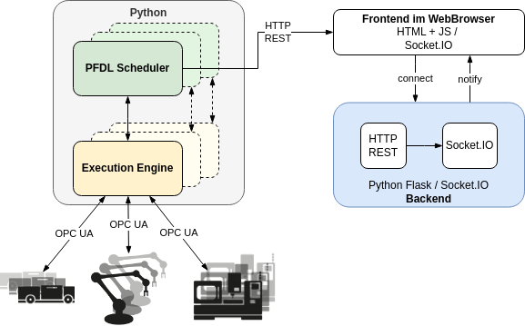
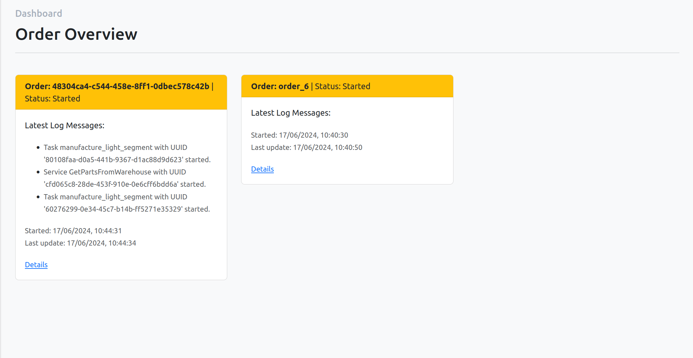
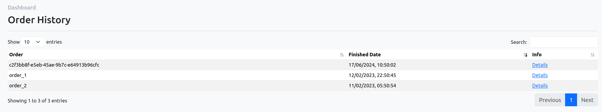
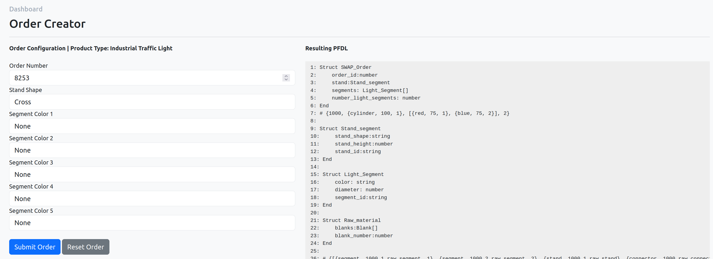
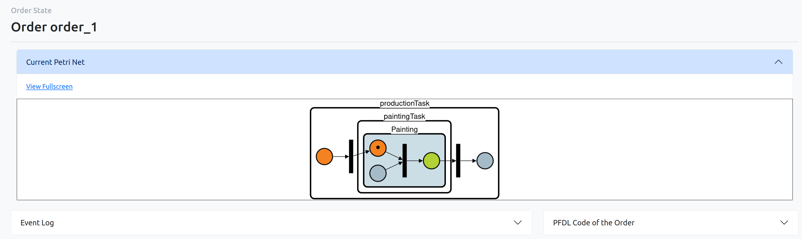
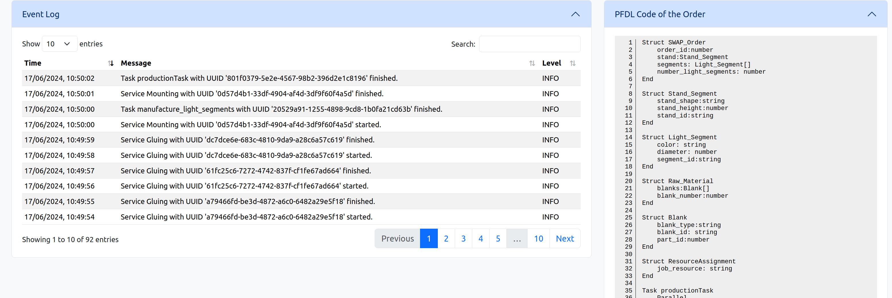
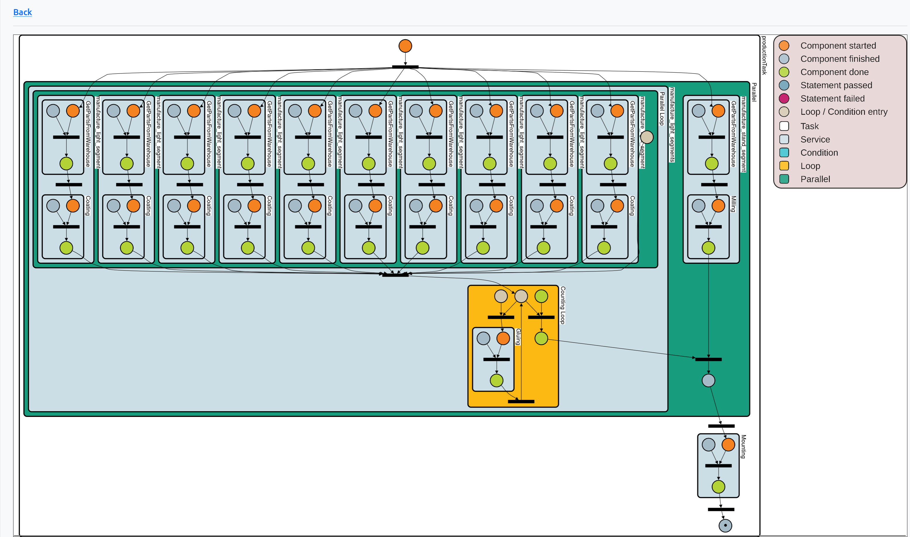

<!--
SPDX-FileCopyrightText: The SWAP-IT Dashboard Contributors
SPDX-License-Identifier: MIT
-->

<div align="center">
  
SWAP-IT Dashboard
===========================



</div>

---

<div align="left">

The SWAP-IT Dashboard is a visualization and management tool for an Order Controlled Production.
This tool can visualize orders that are described by the Production Flow Description Language (PFDL).

## Table of Contents

<!-- TOC depthFrom:2 depthTo:2 updateOnSave:false -->

- [Features](#features)
- [Install](#install)
- [Usage](#usage)
- [Testing](#postman-test)
- [Release Notes](#release-notes)
- [License](#license)

## Features

### Order Overview

A compact overview over all active orders, including the latest log messages.


### Order History

Once an order is finished, it is removed from the order overview, but kept in a seperate list to be still able to view all relevant information.



### Order Creator

Create a new order with customly defined options using the integrated Order Creator.


### Detailed Order View

Show detailed information about a specific order (either active or finished) in the Order State View. All received logs are listed here. Furthermore, a graphical presentation of the corresponding PFDL program as well as the underlying PFDL code are visible here.





### Detailed Code Visualization

In addition to the static Petri Net view in the order state, a full screen mode for further analysis is also provided. Here, all features from the [PFDL VS Code Extension](https://github.com/iml130/pfdl-vscode-extension) Code Visualization are supported. See [the documentation](https://github.com/iml130/pfdl-vscode-extension?tab=readme-ov-file#code-visualization) for more information.



## Install

There are some requirements that need to be installed before using the Dashboard:

- [Python](https://www.python.org/) (>= v3.10)
- Pip packages from [requirements.txt](requirements.txt) (install with `pip install -r requirements.txt`)
- [NodeJS](https://nodejs.org/en/) (>=v18.17.1)

After installing the requirements, install the included NPM packages via `npm install`

The SWAP-IT Dashboard uses the code provided by the [PFDL VS Code Extension](https://github.com/iml130/pfdl-vscode-extension) to create and visualize Petri Nets. To enable this, you need to go to the repository's [release page](https://github.com/iml130/pfdl-vscode-extension/releases), select the latest release and download the _bundle.js_ file provided there. This file needs to be copied to the _static/js_ directory.

After following the steps above, the Dashboard is ready to go!

## Usage

To start the Dashboard from VS Code, just select and start the _SWAP-IT Dashboard_ debug script. To run the Dashboard using the command line, execute the following commands:

```
npm run browserify && python3 application.py
```

After startup, the server log contains the host address.
Now, the Dashboard can be used inside a browser of your choice.

To create orders, log entries or new Petri Net images, a tool like JMeter or Postman is recommended, so dummy requests can be send to the application.

## Testing

To test the Dashboard with some examplary requests, run the provided test collection that can be found in the [test directory](test). To load it into Postman, simply click on the "Import" button and select the .json file. The tests can be executed afterwards by clicking the "Run" button in the "Collections" tab.

## Release Notes

### v0.1.0

- First release

## License

SWAP-IT Dashboard is licensed under the MIT License. See [LICENSE](LICENSE) for details on the licensing terms.
